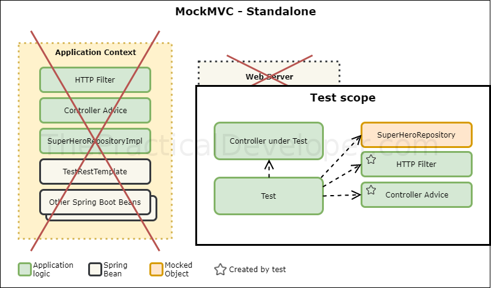
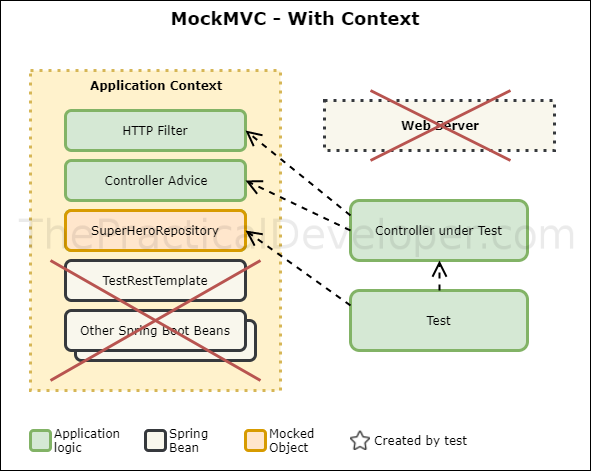
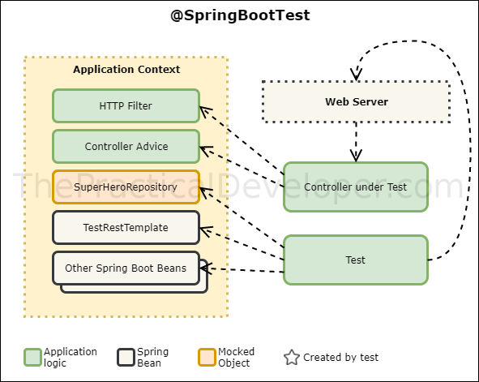

# Spring Boot Testing Strategies

## Introduction

This sample application made with Spring Boot is intended to show the different approach for testing, from Unit Tests with MockMVC in Standalone mode to full `@SpringBootTest` as Integration tests between the modules.

The complete guide is available on [The Practical Developer Blog](https://thepracticaldeveloper.com/2017/07/31/guide-spring-boot-controller-tests/).

## The application

The logic behind the application is simple: it's a repository of superheroes that you can access through a REST API. It allows to read the available ones (which are hardcoded when the application starts up) and also add new members to the crew.

The architecture is simple: just the Controller layer (REST) and a `SuperHeroRepository`. To illustrate the differences when creating tests, there are two extra classes that work at a web layer level:

* `SuperHeroExceptionHandler`. It's a `ControllerAdvice` that will transform a `NonExistingHeroException` into a `404 NOT_FOUND` HTTP error code.
* `SuperHeroFilter`. This web filter adds a new header to the HTTP response. 

## Testing strategies

In the test sources you can find four different approaches to test the Controller. `SuperHeroControllerMockMvcStandaloneTest`. Uses a `MockitoJUnitRunner` and it's the most lightweight approach.

Then you can find two approaches using a Spring context, both use `MockMVC` and one of them already introduces the `@SpringBootTest` annotation.

Finally, `SuperHeroControllerSpringBootTest` shows how to write a `@SpringBootTest` based test mocking other layers but utilizing the web server with a `RestTemplate`. 

To check conclusion and more information please visit [the blog](https://thepracticaldeveloper.com/2017/07/31/guide-spring-boot-controller-tests/).